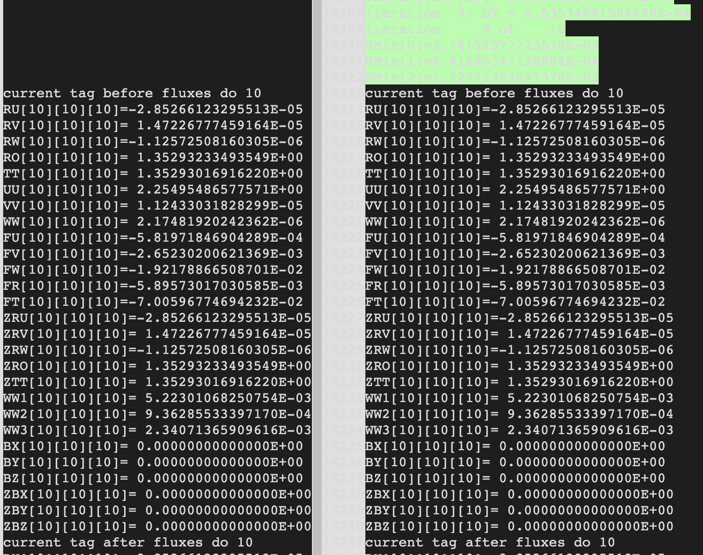
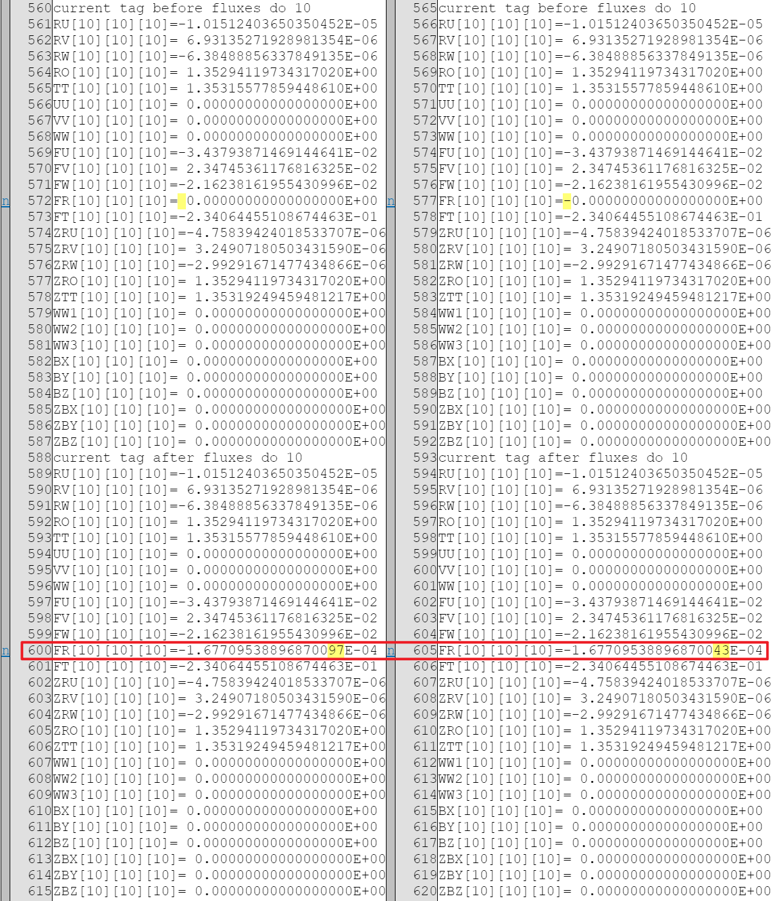
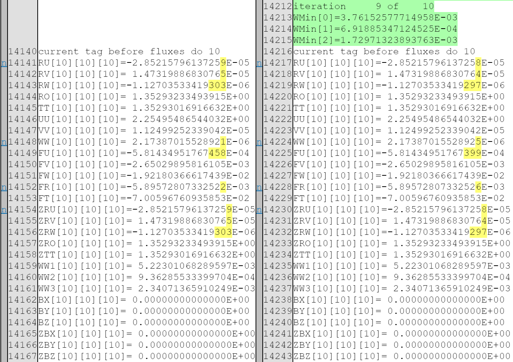

# 3dmhd cpp version

## Outlines

- Introduction
- File tree intro
- Compile and run
- Detailed explain of code
- How to figure out diff with fortran version of 3dmhd
- Further work and concerns


## Introduction

This is 3dmhd code rewritten using c++20. The main features are:
- The high degree of code encapsulation reduces the code size from the original 6,000 lines to about 3,000 lines.
- The global variable characteristics and basic code structure of the original Fortran code are maintained, and the naming of variables is also consistent.
- On default configuration, correctness with original Fortran code are guaranteed.

TODOs:
- [ ] Verify the correctness on other configurations.
- [ ] Optimize performance.
- [ ] Implementation with cuda accelerate (in progress).


## File tree intro

The file tree and explaination of 3dmhd-cpp is listed below:

```shell
├── 3dmhd.cpp
├── 3dmhddata.h
├── 3dmhdio.h
├── 3dmhdmpi.h
├── 3dmhdparam.h
├── 3dmhdphsic.h
├── 3dmhdprint.h
├── 3dmhdset.h
├── 3dmhdsub.h
├── 3dmhdutils.h
├── autodiff.py
├── makefile
├── output
├── README.md
└── test.cpp
```

## Compile and run

This project depends on `openmpi` together with a g++ compiler which supports c++ 20 standard.

```shell
# compile
mpic++ -O2 -std=c++20 3dmhd.cpp -o 3dmhd
# run with 24 processes
mpirun -np 24 ./3dmhd > clog.log
```

**NOTE**: `3dmhd` will print massive logs to `stdout` for debug purpose. A comparison between Fortran and C++ logs will be done (see later sections). To remove these debug logs, just **commented out** the content of function `print_with_tag_index_all` in `3dmhdprint.h`.

## Detailed explain of code

### Explain of 0-index and 1-index, memory placement

Fortran and C++ are two different programming languages with distinct conventions for **array indexing** and **memory layout**. These differences can be summarized as follows:

1. Array Indexing:
   - Fortran uses 1-based indexing, which means that the first element of an array is accessed with the index 1. For example, in Fortran, if you have a 3-dimension array `RU`, you would access an element as `RU(x, y, z)`, with x, y, and z starting from 1.
   - C++ uses 0-based indexing, so the first element of an array is accessed with the index 0. In C++, if you have a 3-dimension array `RU`, you would access an element as `RU[x-1][y-1][z-1]`, with x, y, and z starting from 0.

2. Memory Layout:
   - In Fortran, memory is typically laid out in a column-major order, which means that elements along the first dimension are stored consecutively in memory. In the case of a 3D array `RU(z, y, x)`, the elements along the first dimension (z) are contiguous in memory, making it efficient for certain types of operations.
   - In C++, memory is laid out in a row-major order, with elements along the last dimension being stored consecutively in memory. For a 3D array RU[z][y][x], the elements along the last dimension (x) are contiguous in memory.

For a better performance and consistent of for loop logical. The arrays in C++ use:

- same access name and logical as Fortran but with a 1-0 offset diff. access location of (x, y, z) in C++ is logically equivalent as access location of (x+1, y+1, z+1) in Fortran array.
- same memroy layout in logical, i.e. memory is contiguous in x dimension.

In summary, **expression `RU(x, y, z)` in Fortran is equivalent to `RU[z-1][y-1][x-1]` in C++** in our rewrite design.

### Explain of macro and configuration options

- For 3D array, we define it as a type by `typedef double data[nz][ny][nx];`.
- Configuration of `lRot`, `lMag`,`lPot`,`lRem`,`lShr`, `izCon`, `iyCon`, `ixCon` etc is done by macros, this can lead to better binary generation and compile optimizations.
- Nested loop on x,y,z dim is widely used, so we define macro `FOR3D` for simplify. It extends to `For(z, zl, zr) For(y, yl, yr) For(x, xl, xr)`, where `xl, xr, yl, yr, zl, zr` are bounds on each dimension. The bounds are commonly passed as function paramters, so we define macro `FORRANGEPARAM` as `int zl, int zr, int yl, int yr, int xl, int xr` for short, and macro `FORRANGE` as `zl, zr, yl, yr, xl, xr`.


### Explain of template coding operator abstracting

In this section, there will be a example showing how we re-implmented the original fortran program to c++ program.

Take the loop DO 530 in the subroutine FLUXES as the example. The fortran code writes:

```fortran
      DO 530 K=ILAP/2+1,NZ-ILAP/2
        TMPZ1=HZ*D2ZZDZ2(K)
        TMPZ2=H2Z*DZZDZ(K)*DZZDZ(K)
      DO 530 J=2,NY-IY+1
        TMPY1=HY*D2YYDY2(J)
        TMPY2=H2Y*DYYDY(J)*DYYDY(J)
      DO 530 I=2,NX-IX+1
	     FU(I,J,K)=FU(I,J,K)+ORE*(
   2		  	C43*((UU(I+1,J,K)-UU(I-1,J,K))*HX*D2XXDX2(I)
   3		  	 +(UU(I+1,J,K)-2.0E00*UU(I,J,K)+UU(I-1,J,K))
   4		 		      	      *H2X*DXXDX(I)*DXXDX(I))
   5		 		     +(UU(I,J+1,K)-UU(I,J-1,K))*TMPY1
   6		 	  +(UU(I,J+1,K)-2.0E00*UU(I,J,K)+UU(I,J-1,K))
   7						       	       *TMPY2
   8		 		     +(UU(I,J,K+1)-UU(I,J,K-1))*TMPZ1
   9		          +(UU(I,J,K+1)-2.0E00*UU(I,J,K)+UU(I,J,K-1))
   1						      	       *TMPZ2)
```

First, the code can be splitted into three identical operation in three dimensions (x, y, z). Focus on the x dimension, it is:
```fortran
      DO 530 K=ILAP/2+1,NZ-ILAP/2
      DO 530 J=2,NY-IY+1
      DO 530 I=2,NX-IX+1
	     FU(I,J,K)=FU(I,J,K)+ORE*(
   2		  	C43*((UU(I+1,J,K)-UU(I-1,J,K))*HX*D2XXDX2(I)
   3		  	 +(UU(I+1,J,K)-2.0E00*UU(I,J,K)+UU(I-1,J,K))
   4		 		      	      *H2X*DXXDX(I)*DXXDX(I)))
```

Then, the code can be splitted into two sections by different difference used. The first section is: `FU(I,J,K) = FU(I,J,K) + ORE * C43 * (UU(I+1,J,K) - UU(I-1,J,K)) * HX * D2XXDX2(I)`. The second section is: `FU(I,J,K) = FU(I,J,K) + ORE * C43 * (UU(I+1,J,K)-2.0E00*UU(I,J,K)+UU(I-1,J,K))*H2X*DXXDX(I)*DXXDX(I)))`.

We created templates for caculating difference in three dimensions. `dFdu` is created for caculating first order difference. We can replace `UU(I+1,J,K) - UU(I-1,J,K)` with `dFdu<DIM::X>(UU,I,J,K)`. And `d2Fduu` is created for caculating second order difference. We can replace `UU(I+1,J,K)-2.0E00*UU(I,J,K)+UU(I-1,J,K)` with `d2Fduu<DIM::X>(UU,I,J,K)`.

We also created templates `Hu`, `d2uudu2`, `h2u`, `duudu` for indexing `HX`, `D2XXDX2`,`H2X`, `DXXDX` using the DIM::X. So we can replace `D2XXDX2` with `d2uudu2<DIM::X>`. Note that though   `DXXDX` and `D2XXDX2` are one dimension arrays, we still need indecies on three dimensions for implementing the templates for three dimensions.

Utilizing the templates, the code can be rewritten into 
```fortran
      DO 530 K=ILAP/2+1,NZ-ILAP/2
      DO 530 J=2,NY-IY+1
      DO 530 I=2,NX-IX+1
	     FU(I,J,K)=FU(I,J,K)+ORE*C43
   2		  	 (dFdu<DIM::X>(UU,I,J,K)*hu<DIM::X>*d2uudu2<DIM::X>(I,J,K)
   3		  	 +d2Fduu<DIM::X>(UU,I,J,K)*h2u<DIM::X>*duudu<DIM::X>(I,J,K)*duudu<DIM::X>(I,J,K))
```

We noticed that through the program, there are a lot for loop using the same computing pattern, the differnces are dimension, the scalar to be multiplied, destination array, source array and how the destination be changed(the result is added/substracted to the destination, or the destination is set to the result). In DO 530, the result is added to the destination array `FU`. So we abstracted this computing pattern into a template `func_d2`. 

The source code of the template `func_d2` is:

```cpp
template <OPT opt, DIM dim> void func_d2(FORRANGEPARAM, data tar, const data src, double scale = 1) {
    SingleFOR3D oper<opt>(tar[z][y][x],
                          (dFdu<dim>(src, z, y, x) * d2uudu2<dim>(z, y, x) * hu<dim>() +
                           d2Fdu2<dim>(src, z, y, x) * square(duudu<dim>(z, y, x)) * h2u<dim>()) *
                              scale);
}
```

`SingleFOR3D` is a marco defining a 3D for loop.

So the computation on dimension x in DO 530 can be replaced by one function call: `func_d2<OPT::ADD, DIM::X>(FORRANGE, FU, UU, ORE * C43);`.

Finally, we use three line in C++ to implement DO 530 loop in fortran:

```cpp
func_d2<OPT::ADD, DIM::X>(FORRANGE, FU, UU, ORE * C43); // do 530.1
func_d2<OPT::ADD, DIM::Y>(FORRANGE, FU, UU, ORE);   // do 530.2
func_d2<OPT::ADD, DIM::Z>(FORRANGE, FU, UU, ORE);   // do 530.3
```

## (!! important !!) How to figure out diff with Fortran version of 3dmhd 

As mentioned before, we've add debug prints in the C++ code, runs will print lots of values of all major 3D matrix in the certain index at different point. As the operation is rely on neighbor values, if some operater goes wrong, all value will have an error, so when the value at certain index of all array is same with origin fortran code, we will have a high confidence of correctness of our implement, and if there any problem, it is easy to figure out which step goes wrong because we have debug print at different point.

Below we introduce how to do corectness mapping between C++ and Fortran.

### Diff with Fortran code

We also provide a version of Fortran code that have the sample style of debug print with C++. So we could do a diff of stdout of both program to verify the correctness.

Compile the fortran with debug print just using `make` command or manually using following:

```
mpifort -O2 -std=legacy -ffixed-form -c  3dmhd.f
mpifort -O2 -std=legacy -ffixed-form -c  3dmhdset.f
mpifort -O2 -std=legacy -ffixed-form -c  3dmhdsub.f
mpifort -O2 -std=legacy -ffixed-form -c  3dmhdprint.f
mpifort -O2 -std=legacy -ffixed-form 3dmhd.o 3dmhdset.o 3dmhdsub.o 3dmhdprint.o   -o 3dmhd
```

run the Fortran program:

```
mpirun -np 24 ./3dmhd > flog.log
```

To figure out the difference, we would like to use a python script to diff the log, then generate a html file, with the visualize of diff between `flog.log` and `clog.log`, we could easily capture the detailed infomation.

```
python diff.py -f /path/to/flog.log -c path/to/clog.log  -o diff.html
```

Then using browser or `HTML Preview` extension of VSCode to view `diff.html`.

Here is an example of difference at index (10, 10, 10) after 9 iterations with all values equal in high precision.


**Fig1**. 14-digits difference in **9th** iteration.

### Numerical diff

After turning on the `lRot` switch, we observed some numerical differences bewteen Fortran and C++ code. A simple example is shown below.

#### Reproduce example

For **C++** code, we modify line 9 in `3dmhdparam.h` from `#define lRot false` to `#define lRot true`. And we set `par[4]` (`RY`) and `par[5]` (`ANG`) in `3dmhdset.cpp`. i.e. we change 

```cpp
   par[3] = 10;
   par[11] = 0.1f;
```

to

```cpp
   par[3] = 10;
   par[4] = 10.f;
   par[5] = 0.25f;
   par[11] = 0.1f;
```

----

For **Fortran** code, we modify line 8 in `3dmhdparam.f` from

```fortran
        PARAMETER(LROT=.FALSE.,LMAG=.FALSE.,LPOT=.FALSE.,LREM=.FALSE.,
     2		  LSHR=.FALSE.)
```

to

```fortran
        PARAMETER(LROT=.TRUE.,LMAG=.FALSE.,LPOT=.FALSE.,LREM=.FALSE.,
     2		  LSHR=.FALSE.)
```

And modify line 109~110 in `3dmhdset.f` from

```fortran
	PAR(05)  =  0.0E00
	PAR(06)  =  0.0E00
```

to

```fortran
	PAR(05)  =  10.0E00
	PAR(06)  =  0.25E00
```

Then we find a numerical difference at the very beginning of iteration 1, after loop `DO 10` in the second call of `fluxes`:


**Fig2**. 17-digits difference in **1st** iteration with `lRot` enabled.

This difference will spread and accumulate in the following iterations:


**Fig3**. 14-digits differences in **9th** iteration with `lRot` enabled.

here is an example of difference at index (10, 10, 10)  ater 9 iteration all values are equal with high precision.


<!-- #### Code diff explain -->


